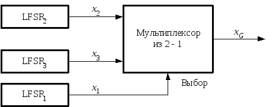
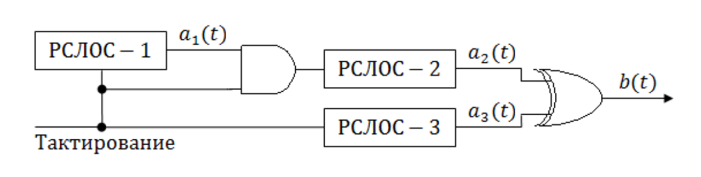
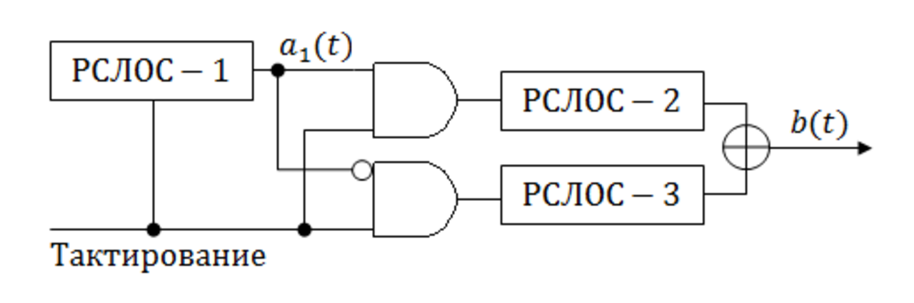

# Контрольное мероприятие № 3

## Последовательностные схемы

### Предварительное задание

Выполнить следующие упражнения практикума по теме "Работа № 3. Последовательностная логика. Неблокирующее присваивание. Параметризация":

1. Двухразрядный двоично-десятичный счётчик на основе одноразрядного двоично-десятичного счётчика.
2. Двухразрядный двоично-десятичный счётчик до 60 (от 0 до 59) на основе параметризуемого одноразрядного двоично-десятичного счётчика.
3. Делитель частоты с детектированием переднего фронта.
4. Параметрический кольцевой сдвиговый регистр с вводом начального значения.
5. Система антидребезга контактов на основе счётчика.
6. Широтно-импульсный модулятор с регулированием кнопками отладочной платы длительности состояния включения светодиода при частоте мигания 0,5 Гц.

### Основное задание

К выполнению основного задания допускаются студенты, выполнившые все предварительные задания. Для получения оценки выше 3 необходимо выполнить все пункты до текущей оценки. Итоговая оценка определяется как полусумма оценок за темы "Пищалка" и "РСЛОС" при условии выполнения хотя бы по одному заданию из каждой темы.

#### Пищалка

1. *На 3 балла*. Вывести на зуммер звук частотой 1 кГц (коэффициент заполнения 50 %). Кнопками задавать увеличение или уменьшение частоты на 1 кГц. Спроектировать тестовый стенд для определения достоверности работы спроектированного модуля. Продемонстрировать работу на отладочной плате, изменяя частоту сигнала от 1 кГц до 20000 Гц.
2. *На 4 балла*. Вывести на зуммер по нажатию кнопки генерацию одиночного звука, соответствующего ноте от *До* до *Си* в заданной DIP-переключателями [октаве](https://ru.wikipedia.org/wiki/Октавная_система) с 1 по 7. *Указание: для задаваемых октав предусмотреть необходимое количество DIP-переключателей. Для выводимой ноты предусмотреть задание кода оставшимися DIP-переключателями.*
3. *На 5 баллов*. Вывести на зуммер небольшой узнаваемый отрывок из следующих музыкальных произведений, не прибегая к использованию конечных автоматов:

| Номер | Произведение   |
|-------|----------------|
| 1.    | [Имперский марш](https://youtu.be/cNgaPG0HNug) из к/ф "Звёздные войны" |
| 2.    | [Гимн России](https://music.yandex.ru/album/87715/track/787227)    |
| 3.    | [Марш Мендельсона](https://music.yandex.ru/album/10230090/track/28529443) |
| 4.    | [Тема](https://music.yandex.ru/album/2265992/track/20074441)  из к/ф "Охотники за приведениями" |
| 5.    | Музыка из игры [Марио](https://music.yandex.ru/album/2035250/track/18327671) |
| 6.    | Марш [Прощание славянки](https://music.yandex.ru/album/10603705/track/65502629) |
| 7.    | [Герой асфальта](https://music.yandex.ru/album/61483/track/575042), гр. Ария |
| 8.    | [Du hast](https://music.yandex.ru/album/7166032/track/22771), гр. Rammstein  |

#### Регистр сдвига с линейной обратной связью (РСЛОС)

1. *На 3 балла*. Реализовать 16-битный генератор псевдослучайной последовательности на основе РСЛОС Фибоначчи и Галуа для заданных параметров (порождающий многочлен). Инициализирующая последовательность равна 0xA2C1.

| Номер | Порождающий многочлен                  |
|-------|----------------------------------------|
| 1     | $x^3+x^2+1$                            |
| 2     | $x^4 + x^3 + 1$                        |
| 3     | $x^6 + x^5 + 1$                        |
| 4     | $x^7 + x^6 + 1$                        |
| 5     | $x^8 + x^6 + x^5 + x^4 + 1$            |
| 6     | $x^9 + x^5 + 1$                        |
| 7     | $x^{12} + x^{11} + x^{10} + x^{4} + 1$ |
| 8     | $x^{15} + x^{14} + 1$                  |

2. *На 4 балла*. Для генератора ПСП из п. 1 выполните анализ случайности полученной последовательности. Для этого задайте генерацию в течении 10000 тактов (или более) синхросигнала. Проведите анализ:
    - доли нулей и единиц, появляющихся в последовательности;
    - частоты появления уникальных последовательностей 00, 01, 10 и 11;
    - частоты появления последовательностей 000, 001, 010, 011, 100, 101, 110 и 111.

Для анализа можно использовать возможности SystemVerilog с использованием цикла `for`.

Также можно использовать возможность выдачи сгенерированной последовательности в файл при помощи системных задач `$fopen`, `$fdisplay` и `$fclose`, затем провести анализ файла на любом известном Вам языке программирования.

Для этого необходимо в папке проекта QuartusPrime **simulation/ModelSim** создать файл, например, с именем Sequence.txt.

```systemverilog
module tb;

//объявить переменную, хранящую дескриптор файла и открыть файл в  режиме записи
int fd;
initial begin
  $fopen(fd, "Sequence.txt", "w");
end

//каждый фронт тактового синхросигнала записывать в файл  выходной сигнал с именем outPRS в бинарном формате
always @(posedge clk) begin
  $fdisplay(fg, "%b", outPRS);
end

//по достижению окончания времени моделирования закрыть  файл и остановить моделирование
initial begin
  #(TIME_MODEL) $fclose(fg);
  $stop;
end

endmodule
```

3. *На 5 баллов*. На основе генератора ПСП конструкции Галуа из п. 1 соберите управляемый генератор и проведите анализ его работы по аналогии с п. 2 (в качестве второго и третьего РСЛОС выберите соседние порождающие многочлены из списка п. 1 или измените инициализирующую последовательность):

| Номер | Генератор                 |
|-------|---------------------------|
| 1     | Генератор Геффа           |
| 2     | Генератор "стоп-пошёл"    |
| 3     | Чередующийся "стоп-пошёл"  |
